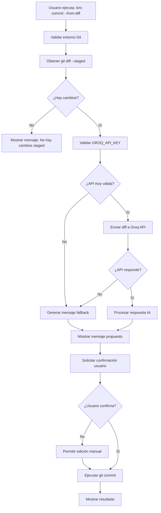

# Design Document

## Overview

Kiro Commit Buddy es una herramienta CLI implementada como un script Python ligero que se integra con Kiro como comando nativo. La arquitectura sigue un patrón de pipeline simple: obtener diff → procesar con IA → presentar al usuario → ejecutar commit. El diseño prioriza la simplicidad, robustez ante fallos, y una experiencia de usuario fluida.

## Architecture



## Components and Interfaces

### 1. CLI Handler (`commit_buddy.py`)
**Responsabilidad:** Punto de entrada principal y orquestación del flujo
```python
class CommitBuddy:
    def main(args: List[str]) -> int
    def handle_from_diff() -> int
```

### 2. Git Interface (`git_operations.py`)
**Responsabilidad:** Interacciones con Git
```python
class GitOperations:
    def get_staged_diff() -> str
    def is_git_repository() -> bool
    def commit_with_message(message: str) -> bool
    def get_changed_files() -> List[str]
```

### 3. Groq API Client (`groq_client.py`)
**Responsabilidad:** Comunicación con la API de Groq
```python
class GroqClient:
    def __init__(api_key: str)
    def generate_commit_message(diff: str) -> str
    def is_api_available() -> bool
```

### 4. Message Generator (`message_generator.py`)
**Responsabilidad:** Lógica de generación de mensajes (IA + fallback)
```python
class MessageGenerator:
    def generate_message(diff: str, files: List[str]) -> str
    def generate_fallback_message(files: List[str]) -> str
    def validate_conventional_format(message: str) -> bool
```

### 5. User Interface (`user_interface.py`)
**Responsabilidad:** Interacción con el usuario
```python
class UserInterface:
    def show_proposed_message(message: str) -> bool
    def allow_message_editing(message: str) -> str
    def show_error(error: str) -> None
    def show_success(message: str) -> None
```

### 6. Kiro Integration (`kiro_hook.py`)
**Responsabilidad:** Registro y configuración como comando Kiro
```python
class KiroHook:
    def register_command() -> None
    def get_command_config() -> dict
    def validate_hook_configuration() -> bool
    def debug_command_registration() -> dict
```

## Data Models

### CommitRequest
```python
@dataclass
class CommitRequest:
    diff: str
    changed_files: List[str]
    repository_path: str
    use_fallback: bool = False
```

### CommitResponse
```python
@dataclass
class CommitResponse:
    message: str
    confidence: float
    source: str  # "groq_api" | "fallback"
    conventional_type: str  # "feat" | "fix" | "docs" etc.
```

### GroqAPIRequest
```python
@dataclass
class GroqAPIRequest:
    model: str = "llama3-70b-8192"
    messages: List[dict]
    max_tokens: int = 150
    temperature: float = 0.3
```

## Error Handling

### 1. Git Repository Validation
- **Error:** No es un repositorio Git
- **Handling:** Mostrar mensaje claro y salir con código 1
- **User Experience:** "Error: No estás en un repositorio Git"

### 2. No Staged Changes
- **Error:** No hay cambios en staging
- **Handling:** Mostrar mensaje informativo y salir con código 0
- **User Experience:** "No hay cambios staged para commit. Usa 'git add' primero."

### 3. Missing API Key
- **Error:** Variable GROQ_API_KEY no configurada
- **Handling:** Mostrar instrucciones de configuración y usar fallback
- **User Experience:** "GROQ_API_KEY no configurada. Usando mensaje básico..."

### 4. API Connection Failures
- **Error:** Timeout, network error, API down
- **Handling:** Catch exceptions, log error, usar fallback automáticamente
- **User Experience:** "API no disponible, generando mensaje básico..."

### 5. Invalid API Response
- **Error:** Respuesta malformada o vacía de la API
- **Handling:** Validar respuesta, usar fallback si es inválida
- **User Experience:** Transparente para el usuario, usa fallback

### 6. Git Commit Failures
- **Error:** git commit falla (conflictos, permisos, etc.)
- **Handling:** Capturar stderr de git, mostrar error específico
- **User Experience:** Mostrar el error exacto de Git

## Testing Strategy

### 1. Unit Tests
```python
# test_git_operations.py
def test_get_staged_diff_with_changes()
def test_get_staged_diff_no_changes()
def test_is_git_repository_valid()
def test_is_git_repository_invalid()

# test_groq_client.py
def test_generate_commit_message_success()
def test_generate_commit_message_api_error()
def test_is_api_available_with_valid_key()

# test_message_generator.py
def test_generate_fallback_message()
def test_validate_conventional_format()
```

### 2. Integration Tests
```python
# test_commit_buddy_integration.py
def test_full_flow_with_api()
def test_full_flow_with_fallback()
def test_user_confirmation_flow()
def test_message_editing_flow()
```

### 3. End-to-End Tests
```python
# test_e2e.py
def test_kiro_command_registration()
def test_complete_commit_workflow()
def test_error_scenarios()
```

### 4. Mock Strategy
- **Git Operations:** Mock subprocess calls para git commands
- **Groq API:** Mock HTTP requests con responses predefinidas
- **User Input:** Mock input() calls para testing automatizado
- **Environment Variables:** Mock os.environ para testing de configuración

## Implementation Details

### 1. Groq API Integration
```python
# Prompt template para generar commits
COMMIT_PROMPT = """
Analiza el siguiente git diff y genera un mensaje de commit siguiendo Conventional Commits.

Reglas:
- Usa prefijos: feat, fix, docs, refactor, test, chore
- Máximo 50 caracteres para el título
- Sé específico pero conciso
- En español

Diff:
{diff}

Responde solo con el mensaje de commit:
"""
```

### 2. Fallback Message Logic
```python
def generate_fallback_message(files: List[str]) -> str:
    if len(files) == 1:
        return f"chore: update {files[0]}"
    elif len(files) <= 3:
        return f"chore: update {', '.join(files)}"
    else:
        return f"chore: update {len(files)} files"
```

### 3. Kiro Command Registration
```yaml
# .kiro/hooks/commit.yml
name: "Commit Buddy"
description: "Generate AI-powered commit messages"
command: "python .kiro/scripts/commit_buddy.py"
args:
  - "--from-diff"
triggers:
  - manual
```

### 4. Configuration Management
```python
# config.py
class Config:
    GROQ_API_KEY = os.getenv("GROQ_API_KEY")
    GROQ_MODEL = "llama3-70b-8192"
    GROQ_ENDPOINT = "https://api.groq.com/openai/v1/chat/completions"
    MAX_DIFF_SIZE = 8000  # caracteres
    TIMEOUT = 10  # segundos
```

### 5. User Experience Flow
1. **Comando ejecutado:** `kiro commit --from-diff`
2. **Validación:** Verificar Git repo y staged changes
3. **Procesamiento:** Obtener diff y generar mensaje (API o fallback)
4. **Presentación:** Mostrar mensaje propuesto con colores
5. **Confirmación:** Preguntar "¿Usar este mensaje? (y/n/e para editar)"
6. **Ejecución:** Commit automático o permitir edición manual
7. **Resultado:** Mostrar hash del commit creado

## Debugging and Issue Resolution

### Identified Issues and Solutions

#### Issue 1: Kiro Command Recognition
**Problem:** `kiro commit --from-diff` shows warning "Warning: 'from-diff' is not in the list of known options" and creates empty "commit" file.

**Root Cause Analysis:**
- Hook configuration may have incorrect command structure
- Kiro may not be recognizing the hook properly
- Command parsing issue in Kiro's argument handling

**Solution Strategy:**
1. Verify hook configuration format in `.kiro/hooks/commit.yml`
2. Test different command structures (separate python and script args)
3. Add debugging output to verify hook registration
4. Implement command validation utilities

#### Issue 2: Generic Commit Messages
**Problem:** Always generates "update <files>" instead of using Groq API.

**Root Cause Analysis:**
- API key configuration issues
- API connectivity problems
- Fallback logic being triggered incorrectly
- Error handling masking API failures

**Solution Strategy:**
1. Add comprehensive API debugging utilities
2. Implement verbose logging for API calls
3. Validate API key format and connectivity
4. Improve error reporting for API failures

### Debugging Components

#### Command Registration Debugger
```python
class CommandDebugger:
    def validate_hook_configuration() -> Tuple[bool, List[str]]
    def test_kiro_command_recognition() -> bool
    def verify_script_execution() -> Tuple[bool, str]
    def check_file_permissions() -> bool
```

#### API Integration Debugger
```python
class APIDebugger:
    def validate_api_key() -> Tuple[bool, str]
    def test_api_connectivity() -> Tuple[bool, str]
    def test_sample_api_call() -> Tuple[bool, str, dict]
    def debug_fallback_triggers() -> dict
```

#### Comprehensive Diagnostic Tool
```python
class DiagnosticTool:
    def run_full_diagnostic() -> dict
    def generate_debug_report() -> str
    def test_end_to_end_flow() -> List[Tuple[str, bool, str]]
```

Esta arquitectura asegura robustez, facilidad de testing, y una experiencia de usuario fluida mientras mantiene el código simple y mantenible, con herramientas adicionales para diagnosticar y resolver los problemas reportados.